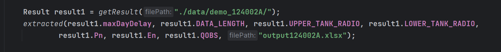

JDK版本：1.8
maven版本3.9.2

在run文件中添加如下代码
Result result1 = getResult("xxx"); //添加读取数据的路径
extracted(result1.maxDayDelay, result1.DATA_LENGTH, result1.UPPER_TANK_RADIO, result1.LOWER_TANK_RADIO,
result1.Pn, result1.En, result1.QOBS, "xxxx.xlsx");//添加输出数据的路径

点击运行即可